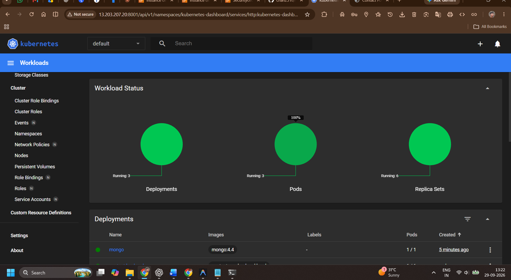
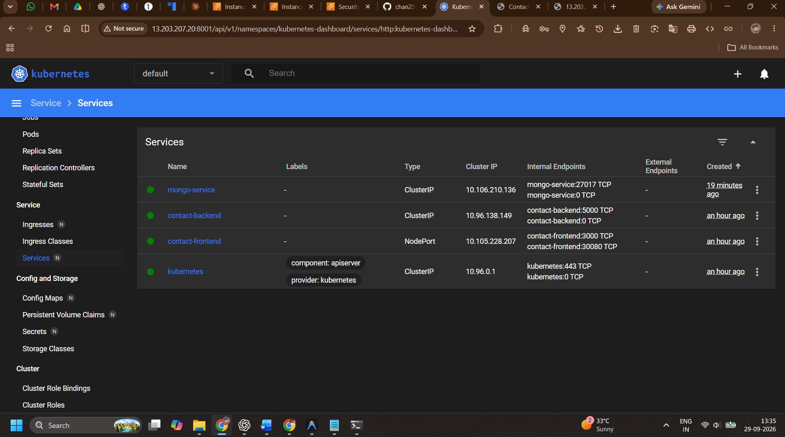
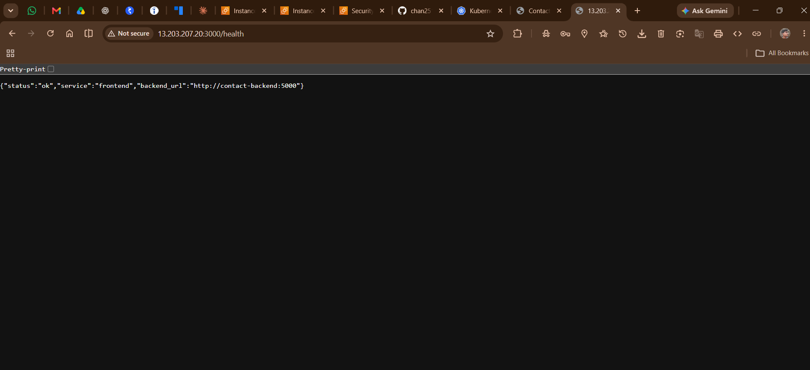
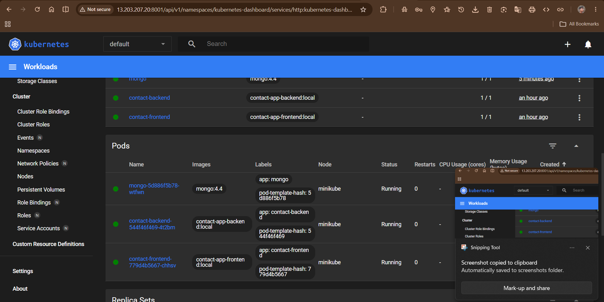

# Activity 1: Local Kubernetes Deployment Submission

## Overview of Deployed Architecture
For this assignment, we successfully deployed a fully independent 3-tier application stack inside a local Minikube Kubernetes cluster. The architecture includes:
1. **Frontend (Node.js/Express):** Exposed externally via a NodePort Service to serve the web UI.
2. **Backend (Python/Flask):** Exposed internally via a ClusterIP Service to handle API requests and business logic.
3. **Database (MongoDB):** We went beyond the standard assignment requirements and deployed our own internal MongoDB Pod and Service, ensuring the application is fully self-contained without needing a cloud database like Atlas.
4. **Secrets:** Configured Kubernetes Secrets to securely inject the MongoDB URI and Flask Secret Key into the backend.

---

## 1. Minikube Status
This screenshot demonstrates that the Minikube cluster is running successfully with the Docker driver, and images are being built.

![Minikube Status][def]

## 2. Docker Images Built in Minikube
This screenshot shows that the backend and frontend Docker images have been successfully built, and the `mongo:4.4` image was deployed into the Minikube environment.

## 3. Pods, Services, and Deployments Status
This screenshot proves that all Kubernetes resources (Frontend, Backend, and MongoDB Deployments/Pods/Services) are properly configured and running without crashing.

## 4. Backend Health Check
This screenshot verifies that the Flask backend is healthy and responding to HTTP requests properly over the forwarded port.

## 5. Frontend UI Browser View
This screenshot shows the final, working web application loaded in the Chrome browser, successfully communicating with the backend and local MongoDB database.

## 6. Kubernetes Dashboard (Bonus)
This screenshot displays the visual overview of the cluster pods running in the Minikube Dashboard.

[def]: assignments/activity-1-kubernetes/screenshots/mini5.png