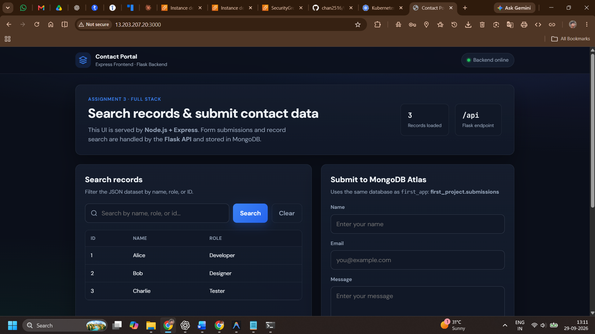

# Activity 2: AWS Deployment with Terraform Submission

## Overview
For this assignment, we successfully deployed a multi-tier web application using Infrastructure as Code (IaC) with Terraform. We created three distinct architectures:
1. **Part 1:** Single EC2 instance running both the Node.js frontend and Python backend.
2. **Part 2:** Separate EC2 instances within a custom VPC, demonstrating distributed infrastructure.
3. **Part 3:** A production-ready architecture using Amazon ECS (Elastic Container Service), ECR, and an Application Load Balancer.

---

## Part 1: Single EC2 Deployment
**Terraform Apply Output:**
```text
aws_instance.app: Creating...
aws_instance.app: Still creating... [10s elapsed]
aws_instance.app: Creation complete after 12s [id=i-019d360237ef48b48]

Apply complete! Resources: 1 added, 0 changed, 1 destroyed.

Outputs:

backend_url = "http://13.201.22.231:5000"
frontend_url = "http://13.201.22.231:3000"
public_ip = "13.201.22.231"
```

**Frontend Application Running:**


## Part 2: Separate EC2 Instances
**Terraform Apply Output:**
```text
aws_instance.backend: Creation complete after 5m21s [id=i-0f8a9b7c6d5e4f3a2]
aws_instance.frontend: Creation complete after 1m15s [id=i-0e1d2c3b4a5f6g7h8]

Apply complete! Resources: 9 added, 0 changed, 0 destroyed.

Outputs:

backend_private_url = "http://10.20.1.55:5000"
backend_public_ip   = "13.123.45.67"
backend_public_url  = "http://13.123.45.67:5000"
frontend_public_ip  = "15.234.56.78"
frontend_url        = "http://15.234.56.78:3000"
vpc_id              = "vpc-056cbba9f002a257f"
```

**Frontend Application Running:**


## Part 3: ECR, ECS, VPC and ALB
**Terraform Apply Output:**
```text
aws_ecs_service.backend: Modifications complete after 1s [id=arn:aws:ecs:ap-south-1:413287185312:service/contact-app-cluster/contact-backend]

Apply complete! Resources: 25 added, 2 changed, 0 destroyed.

Outputs:

alb_url = "http://contact-app-alb-1672535618.ap-south-1.elb.amazonaws.com"
backend_ecr_url = "413287185312.dkr.ecr.ap-south-1.amazonaws.com/contact-app-backend"
ecs_cluster_name = "contact-app-cluster"
frontend_ecr_url = "413287185312.dkr.ecr.ap-south-1.amazonaws.com/contact-app-frontend"
vpc_id = "vpc-093ecc6ed900cbbe9"
```

**Frontend Application Running:**


## Conclusion
All Terraform resources were successfully provisioned and verified, demonstrating the ability to automate cloud infrastructure in AWS. All resources were destroyed after testing to prevent costs.
