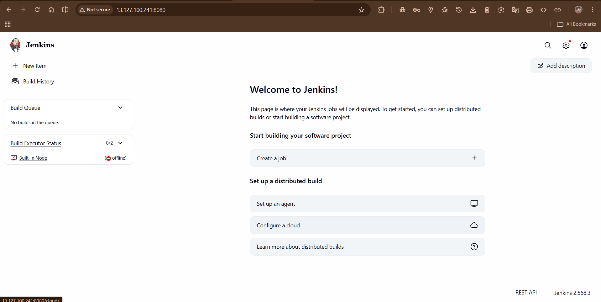
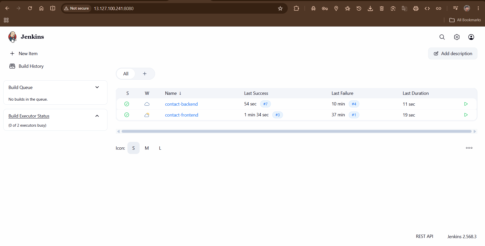
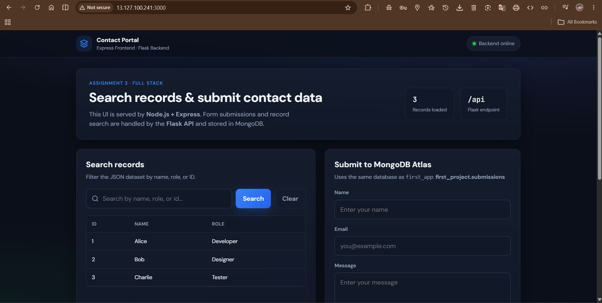
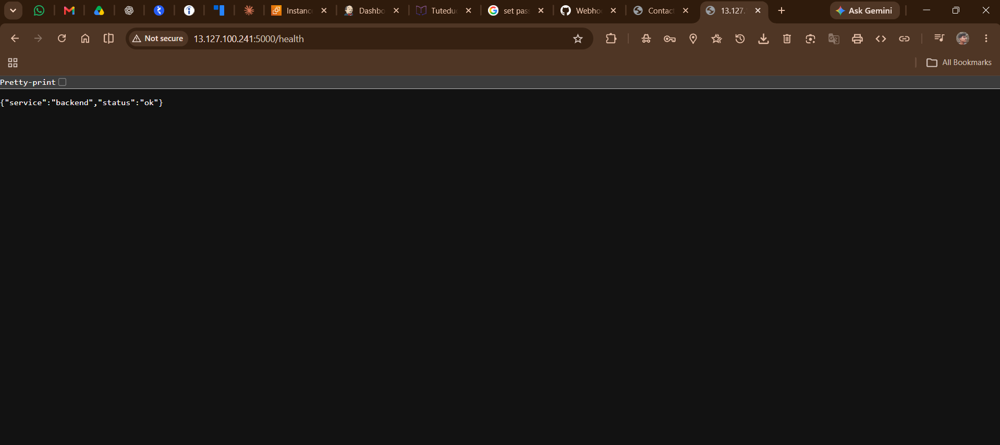
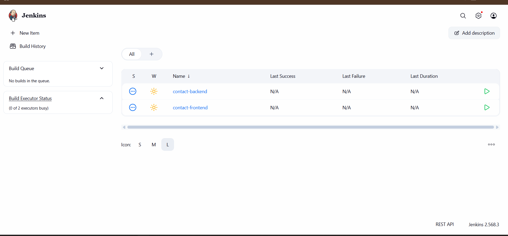
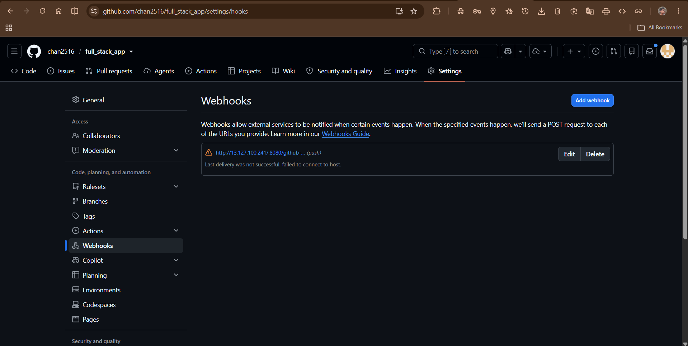

# Activity 3: EC2 Deployment and Jenkins CI/CD

## Overview
For this assignment, we successfully deployed a Flask backend and an Express frontend onto an Amazon EC2 instance (Ubuntu 24.04). We then implemented a robust CI/CD pipeline using Jenkins to automate the deployment process.

## Infrastructure and Security
We launched an AWS EC2 instance (`t3.small`) and configured the Security Group to allow inbound traffic on:
- **Port 22:** SSH Access
- **Port 8080:** Jenkins Dashboard and GitHub Webhooks
- **Port 3000:** Express Frontend
- **Port 5000:** Flask Backend

## Application Setup
- **Flask (Backend):** Configured to run as a persistent systemd background service (`contact-backend.service`).
- **Express (Frontend):** Configured to run via the `pm2` process manager.
- Both applications were successfully tested via `curl` to ensure they were responding on their respective ports.

## Jenkins Automation
We automated the entire deployment lifecycle by creating two separate Jenkins pipelines (`contact-backend` and `contact-frontend`) using Groovy-based `Jenkinsfile`s.

- **Automated Steps:** The pipelines automatically pull the latest code, install dependencies (`pip` and `npm`), run tests, and restart the live applications using their process managers.
- **Webhook Integration:** We configured a GitHub Webhook to automatically trigger these Jenkins pipelines the moment new code is pushed to the `main` branch.

### Technical Challenges Resolved
- **Java Compatibility:** Jenkins dropped support for Java 17. We resolved this by manually installing and configuring `openjdk-21-jre`.
- **Process Tree Killer:** Jenkins aggressively terminates background tasks (like `pm2`) after a build finishes. We successfully bypassed this by injecting `JENKINS_NODE_COOKIE=dontKillMe` into the pipeline environment, allowing the Express app to survive post-deployment.

---

## Evidence Screenshots

### EC2 / Jenkins Configuration

### Pipeline Executions

### Live Application

