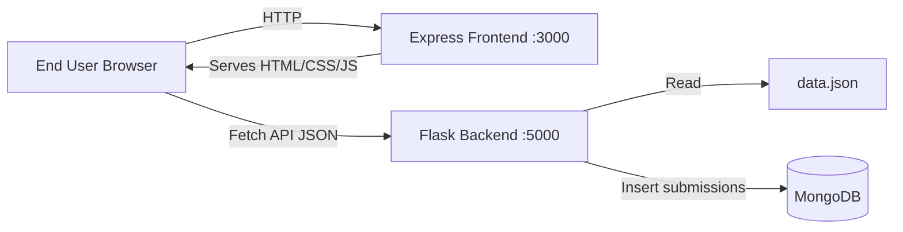
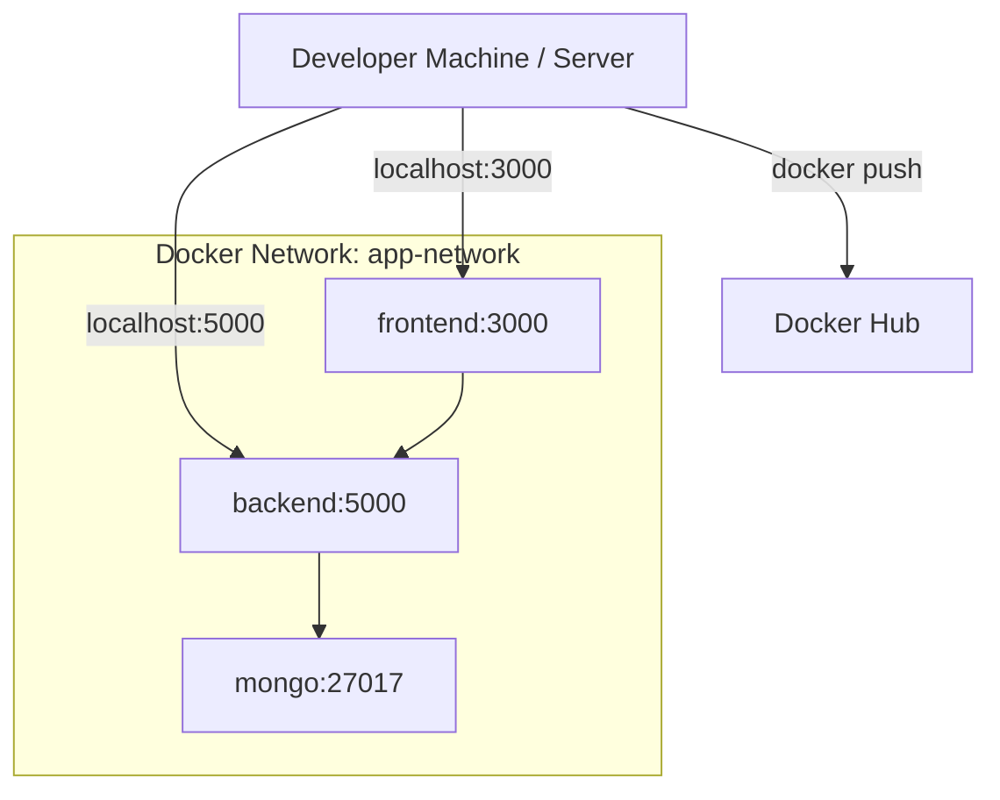

# High-Level Design (HLD)

## 1. Overview

**Contact Portal** is a full-stack web application that separates the user interface (Express/Node.js) from business logic and data persistence (Flask/Python). It extends the Flask Assignment 2 (`first_app`) pattern: users can search a static JSON dataset and submit contact form data to MongoDB.

| Layer | Technology | Responsibility |
|-------|------------|----------------|
| Presentation | Node.js + Express | Serve UI, static assets, expose config to browser |
| API | Flask + Gunicorn | REST endpoints, validation, MongoDB writes |
| Data | MongoDB + `data.json` | Persistent submissions + searchable seed records |

---

## 2. System Context

---

## 3. Architecture Style

- **Client–server** with a thin Express frontend and stateless Flask API.
- **Containerized deployment** via Docker Compose on a shared bridge network (`app-network`).
- **Environment-driven configuration** for backend URL, MongoDB URI, and CORS.

---

## 4. Major Components

### 4.1 Frontend (Express)

- Serves `public/` static files (HTML, CSS, JavaScript).
- Exposes `/config` so the browser knows the Flask API base URL.
- Does **not** process form data; the browser calls Flask directly.

### 4.2 Backend (Flask)

- REST API derived from `first_app` logic:
  - `GET /api/records?q=` — search JSON records
  - `POST /api/submit` — validate and save to MongoDB
  - `GET /api` — raw JSON dump (compatibility with Assignment 2)
  - `GET /health` — health probe for Docker/load balancers

### 4.3 MongoDB

- Stores form submissions (`name`, `email`, `message`).
- Local MongoDB container in Compose, or MongoDB Atlas via `MONGODB_URI`.

---

## 5. Data Flow

### Search flow

1. User types a query in the Express UI.
2. Browser sends `GET /api/records?q=<query>` to Flask.
3. Flask loads `data.json`, filters records, returns JSON.
4. Frontend renders the table.

### Submit flow

1. User fills Name, Email, Message (same fields as `first_app`).
2. Browser sends `POST /api/submit` with JSON body.
3. Flask validates required fields.
4. Flask inserts document into MongoDB.
5. Frontend shows success or error feedback.

---

## 6. Deployment Topology (Docker Compose)

| Service | Host Port | Internal URL |
|---------|-----------|--------------|
| frontend | 3000 | `http://frontend:3000` |
| backend | 5000 | `http://backend:5000` |
| mongo | 27017 | `mongodb://mongo:27017` |

---

## 7. Non-Functional Requirements

| Concern | Approach |
|---------|----------|
| Scalability | Stateless API; horizontal scaling possible behind a reverse proxy |
| Security | Secrets in `.env` (gitignored); CORS restricted in production |
| Observability | `/health` endpoints on frontend and backend |
| Portability | Docker images for both services |

---

## 8. External Integrations

- **MongoDB Atlas** (optional): replace `MONGODB_URI` with Atlas connection string.
- **Docker Hub**: publish `contact-app-frontend` and `contact-app-backend` images.
- **GitHub**: source repository with `.gitignore` excluding `node_modules`, `.vscode`, `.env`.

---

## 9. Assumptions & Constraints

- Browser must reach the Flask API URL configured in `BACKEND_URL` / CORS.
- MongoDB must be available before backend accepts submissions.
- `data.json` ships with the backend image for demo search data.
