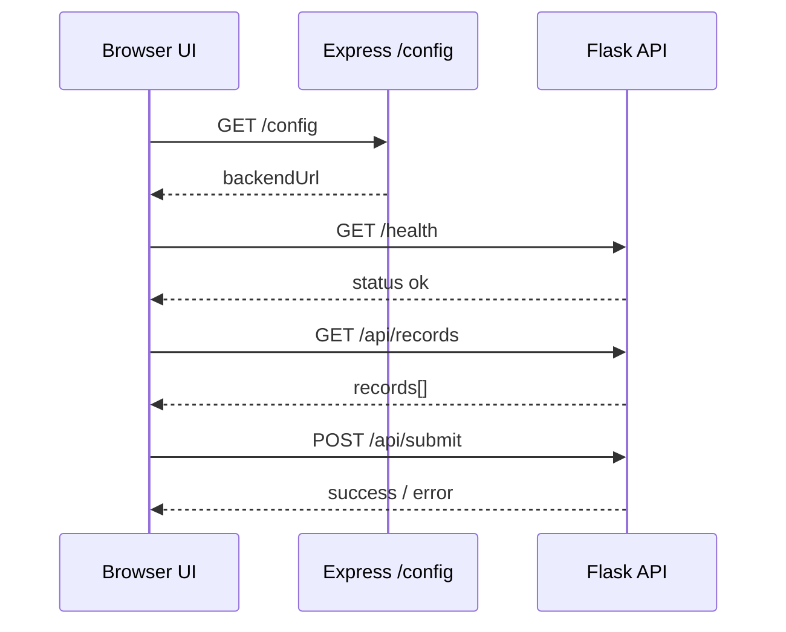
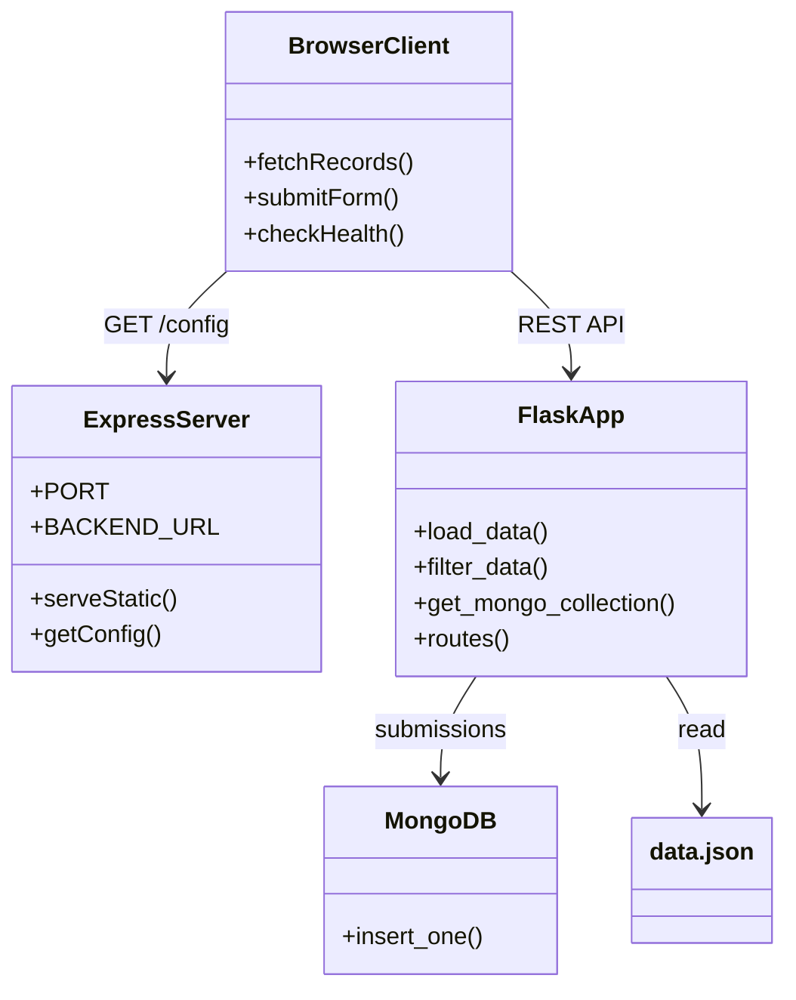

# Low-Level Design (LLD)

## 1. Project Structure

```
fullstack-app/
├── backend/
│   ├── app.py              # Flask API application
│   ├── data.json           # Seed records for search
│   ├── requirements.txt
│   ├── Dockerfile
│   └── .env.example
├── frontend/
│   ├── server.js           # Express static server
│   ├── package.json
│   ├── Dockerfile
│   ├── .env.example
│   └── public/
│       ├── index.html
│       ├── css/style.css
│       └── js/app.js
├── docs/
│   ├── HLD.md
│   └── LLD.md
├── docker-compose.yaml
├── .env.example
├── .gitignore
└── README.md
```

---

## 2. Backend Module Design

### 2.1 `app.py` — Functions

| Function | Input | Output | Purpose |
|----------|-------|--------|---------|
| `get_mongo_collection()` | Env vars | PyMongo collection | DB connection |
| `load_data()` | — | `list[dict]` | Read `data.json` |
| `filter_data(records, query)` | records, search string | filtered list | Case-insensitive search |
| `build_submission_document(form_data)` | dict | MongoDB document | Normalize submission |
| `create_app()` | — | Flask app | Register routes |

### 2.2 API Contract

#### `GET /health`

```json
{ "status": "ok", "service": "backend" }
```

#### `GET /api/records?q={optional}`

**Response 200:**

```json
{
  "records": [
    { "id": 1, "name": "Alice", "role": "Developer" }
  ],
  "search_query": "alice"
}
```

#### `POST /api/submit`

**Request:**

```json
{
  "name": "Jane Doe",
  "email": "jane@example.com",
  "message": "Hello from Express frontend"
}
```

**Response 201:**

```json
{
  "success": true,
  "message": "Data submitted successfully.",
  "id": "665f1a2b3c4d5e6f7a8b9c0d"
}
```

**Response 400:**

```json
{
  "success": false,
  "error": "All fields are required."
}
```

#### `GET /api`

Returns raw `data.json` array (Assignment 2 compatibility).

### 2.3 MongoDB Document Schema

```json
{
  "_id": "ObjectId",
  "name": "string",
  "email": "string",
  "message": "string"
}
```

### 2.4 Error Handling

- Missing MongoDB URI → `RuntimeError` → HTTP 400 with message.
- Empty form fields → `ValueError` → HTTP 400.
- Invalid `data.json` structure → HTTP 500 on `/api/records`.

---

## 3. Frontend Module Design

### 3.1 `server.js`

| Route | Method | Behavior |
|-------|--------|----------|
| `/` + static | GET | Serve `public/` files |
| `/config` | GET | Return `{ backendUrl }` from env |
| `/health` | GET | Frontend health + backend URL |
| `*` | GET | SPA fallback to `index.html` |

**Environment variables:**

| Variable | Default | Description |
|----------|---------|-------------|
| `PORT` | `3000` | Express listen port |
| `BACKEND_URL` | `http://localhost:5000` | Flask API base URL |

### 3.2 `app.js` — Client Logic



| Function | Responsibility |
|----------|----------------|
| `loadConfig()` | Fetch backend URL from Express |
| `checkBackendHealth()` | Update status pill UI |
| `fetchRecords(query)` | Call Flask search API |
| `renderRecords(records)` | Build table rows safely (XSS escape) |
| `showToast()` / `showFormAlert()` | User feedback |

### 3.3 Form Fields (matches `first_app`)

| Field | HTML type | Validation |
|-------|-----------|------------|
| name | text | Required, non-empty |
| email | email | Required, non-empty |
| message | textarea | Required, non-empty |

---

## 4. Docker Design

### 4.1 Backend Dockerfile

- Base: `python:3.12-slim`
- WSGI: Gunicorn with 2 workers
- Port: `5000`

### 4.2 Frontend Dockerfile

- Base: `node:20-alpine`
- `npm install --omit=dev`
- Port: `3000`

### 4.3 Compose Service Dependencies

```
mongo (healthy) → backend (healthy) → frontend
```

Health checks ensure startup order and reliable `depends_on` conditions.

### 4.4 Network

All services attach to `app-network` (bridge). Frontend resolves `backend` by Docker DNS.

---

## 5. Configuration Matrix

| Scenario | `BACKEND_URL` | `MONGODB_URI` | `CORS_ORIGINS` |
|----------|---------------|---------------|----------------|
| Local dev | `http://localhost:5000` | Atlas or local mongo | `http://localhost:3000` |
| Docker Compose | `http://backend:5000` (auto) | `mongodb://mongo:27017` | `http://localhost:3000` |
| Production | Public API URL | Atlas URI | Frontend origin |

---

## 6. Security Considerations (LLD)

- `escapeHtml()` in `app.js` prevents XSS when rendering records.
- CORS limited to configured origins in production.
- `.env` files excluded from Git; use `.env.example` as template.
- No credentials committed to repository.

---

## 7. Class / Component Diagram (Logical)


